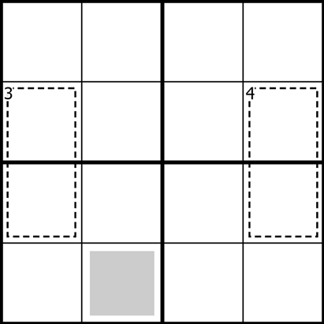
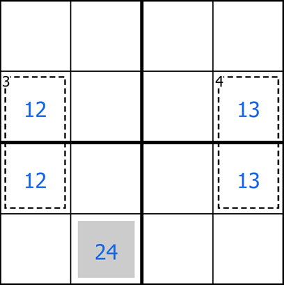
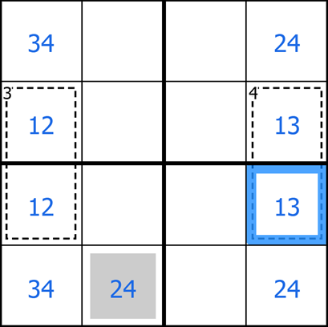
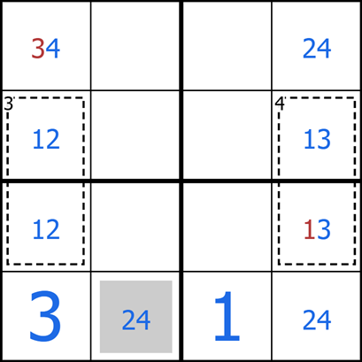

Growing up, I used to do sudokus pretty often. I would buy books of them to chew on when I had to sit around for awhile. It was encouraging that I could solve the easy and medium difficulty ones with a bit of thinking. But when it came to the “hard” or “diabolical” difficulties, it seemed like I was only able to complete them sometimes. Getting stuck on these difficult puzzles was frustrating, and in my desperation, I started resorting to guessing digits and hoping that they would lead to a solution. I think this idea of guessing robbed the joy of the puzzle from me, I got too concerned with finding a solution at any cost, that I ignored the basic premise of the puzzle: use logic to deduce digits. The joy I got from these puzzles slowly diminished and eventually I stopped doing them.

The books of puzzles that I worked through were often computer-generated. This is a quick way to produce a bunch of puzzles so one can work through as many as one likes. But computer-generated puzzles have no clear logical progression, or “soul” to them. Beginner puzzlers who aren’t familiar with some of the more advanced sudoku techniques can easily get lost or stuck and resort to guessing. I think this lead me to believe there wasn’t much depth to sudoku puzzles.

During the pandemic, I happened across a Youtube channel Cracking the Cryptic. Now they have a decently large following with a thriving puzzling community. But after seeing just one of their videos, I was immediately entranced. Simon, the sudoku solver I was watching, was showing this very clear (but not easy) path through a sudoku. A path, by the way, that was not pre-meditated. He solved it right in front of my eyes (as he and Mark do with all of their puzzles). I had never seen a sudoku solved in such an elegant way. Every technique he used, he took the time to explain the logic of so that it was crystal clear for the viewer.

This opened my eyes to some more advanced techniques and I started watching more and more and discovering new rules (like thermometer sudoku, killer sudoku, arrow sudoku, etc). But a key detail that made these solves so enjoyable, was the brilliance of people who designed the puzzle. The idea of a human making a sudoku puzzle was a foreign concept to me at the time. But after seeing how elegant the solutions were, I realized I had found what I was missing. The great guys at Cracking the Cyptic always explained the rules first and then encouraged viewers to attempt to solve for themselves before showing their attempt to solve. It didn’t take long for me to start trying these puzzles myself. Some of them were brutally difficult, some of them were encouragingly approachable. But all the time, I knew for sure that I never had to guess, I could always use the logic of the grid to tell me what digit to place next, if I could just ask it the right questions.

I’ve come to appreciate these sudoku puzzles as miniature mathematical investigations. On one hand they are purely logic. But on the other hand, there was an strong element of discovery and creativity involved. Every puzzle had its own character and behaves a little differently. Coming to understand these behaviours by asking the puzzle questions and seeing how it responds felt to me very similar to how I approach new structures or objects while studying mathematics. For this reason, I have tried to share these puzzles with others, in hopes of giving them a taste of what I experience in mathematics. Rather than being a boring technical subject, mathematics is full of strange behaviours and beautiful logical patterns waiting to be discovered.

To this end, recently I started trying to set some of my own puzzles. I would like to use one of these puzzles to show you how one can use only logic to place all the digits. I have several more puzzles for you to try on your own at the end, but I also encourage you to head on over to Cracking the Cryptic to see many more of higher quality! The puzzles I will share are all 4x4 sudokus. That means, we have a 4x4 grid in which we should place the digits 1,2,3,4, once each in every row, column, and outlined 2x2 box. But I like some added rules too. Let’s see one here:

## Dynamic Duo

  
  

    <ul>
      <li> Normal 4x4 Sudoku rules apply (see above).</li>
      <li> Digits in a cage sum to the number in the top left corner of that cage.</li>
      <li>A digit on a shaded square must be even.</li>
    </ul>
  

One of the eye-catching things about sudokus like this, at least for me, was the idea that you could solve it without any digits given! I encourage you to try this puzzle for yourself here. The key idea that I would like to get across is that you do not have to place any digits in this puzzle that you are not completely sure about. Which means every digit can be logically deduced.

So I will show you my way through this puzzle highlighting the logic that I used to earn every digit I place. We will start by writing out the possibilities of the various restrictions. For example, in the shaded square, we must only place an even digit (from 1,2,3,4). So this can only be a 2 or a 4. The cages are also very restricted. Two digits from 1,2,3,4 that add to 3? That can only be 1 and 2. Two digits that add to 4? That can only be 1 and 3. Now we don’t know the order of these, but they are still useful observations, so we will write “pencil marks” in the centers of the cells, just to keep track of this deduction:

<figure align="center">
  
  <figcaption>“pencil marks” like these help to keep track of restricted cells in the grid, which helps to see patterns and make deductions later.</figcaption>
</figure>

It seems like we still can’t say anything interesting about the puzzle, but let’s keep at it for a bit. For example, by the rules of sudoku, column 1 must contain the digits 1,2,3,4. but we already know where the 1 and 2 are (just not the order). So the “empty” cells in column 1 must house the digits 3 and 4 in some order. Similarly in column 4, we know where the 1 and 3 are, so the remaining cells in column 4 must house the digits 2 and 4. Let’s add these pencil marks in.

  

Now there are at least two things we can notice, and both of them allow us to deduce a digit! Can you see how to place a digit from here?

I’ll mention the question I originally intended first. If we look at the bottom row (row 4), we require the digits 1-4 to be placed in. But where can we place a 1? The fact that there is only one possible location for it, logically demands it to be there. So we can place a 1 in row 4 column 3. It might be worth spending a moment to convince yourself of this if you don’t believe this deduction.

Another observation we could have made was that in the bottom row, there is a pair of cells which can only be 2 or 4. Which means that one of them must be a two and the other must be a 4. So how could row 4 column 1 be a 4? It cannot. This forces it to be a 3!

Placing these digits in, we see that we can start getting other digits using the basic sudoku logic, and in fact, the puzzle collapses soon after.

<figure align="center">
  
  <figcaption>Can you finish the puzzle from here?</figcaption>
</figure>

A couple of things can noticed about this solution path. First, we simply made what little deductions we could based on the individual clues, this lead to restricted cells and some other logic. But later on, it was the combination of the clues (the cages + the even square) that allowed us to “break in” to the puzzle and place some digits. Just to emphasize further: we never made any arbitrary choices or guesses! The final phase of the puzzle is just about using the basic sudoku logic to fill in the grid. Harder puzzles require a deeper understanding of how the rules interact with each other in order to make meaningful deductions and “break in”.

If this puzzle and solve caught your interest, I’ve made [several more](https://daniel-e-pepper.github.io/sudoku/). Also, I highly recommend the Youtube channel Cracking the Cryptic. They have somehow managed to put out a Sudoku solve video from brilliant puzzle constructors every day for the past few years. They are a source of deeply enjoyable puzzles of all difficulties.

