## Geometric Theorems in Sudoku

After diving in to variant sudoku, I learned several techniques like X-wings, Y-wings, hidden singles, pointing pairs, and much more. But it was later that I learned there can be some deeper geometric structure to sudoku than I would have ever considered.

A setter by the name of Phistomefel seems to have made a wonderful discovery in this vein, so much so that the following pattern is named the Phistomefel ring, and the associated theorem is named Phistomefels theorem

<figure style="display: flex; flex-direction: column; align-items: center; justify-content: center; text-align: center;">
  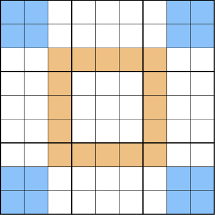
  <figcaption>A normal 9x9 sudoku grid with no numbers. Cells have been coloured in the pattern of “Phistomefel’s Ring”.</figcaption>
</figure>

**Theorem (Phistomefel)** *The collection of digits in the orange cells (see picture above) is equal (including multiplicities) to the collection of digits in the blue cells in any sudoku.*

Remarkable! How can this possibly be true for all sudoku? Let’s investigate why, and in doing so, we can open up a whole new set of tools for approaching sudoku.

*Proof (of Phistomofel's Theorem):* Start with a 9x9 sudoku grid and consider the orange collection of cells as in the following picture. What are the contents of those cells?

<figure style="display: flex; flex-direction: column; align-items: center; justify-content: center; text-align: center;">
  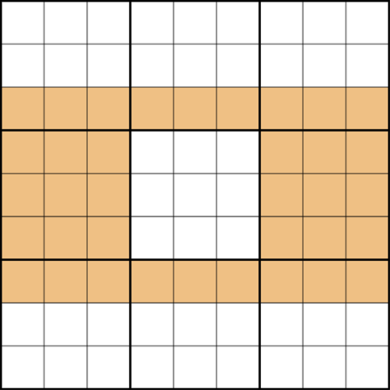
  <figcaption>What are the contents of the orange cells?</figcaption>
</figure>

Well in every sudoku, the contents of the orange cells are the same, by the rules of sudoku! Indeed, we have two complete rows (rows 3 and 7) and two complete boxes (box 4 and box 6). This makes up a total of four complete sets of the digits 1 to 9.

Okay not too interesting yet, but let’s do something similar with a different collection. We consider the blue collection in the picture below. How do we describe the digits in that set?

<figure style="display: flex; flex-direction: column; align-items: center; justify-content: center; text-align: center;">
  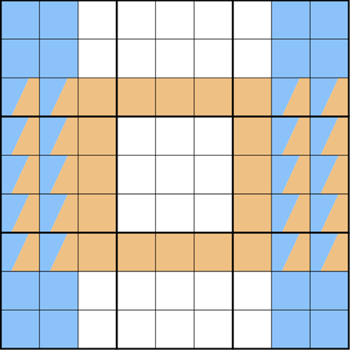
  <figcaption>Can you describe the contents of the blue cells?</figcaption>
</figure>

By similar logic, now we have four complete columns of our sudoku grid, so by the rules of sudoku, we should have four complete sets of the digits 1 to 9 in those too. So in other words, the blue collection and the orange collection have the same set of digits! You may notice that we are almost there already.

There’s just one more observation to make. Namely, consider the cells that are coloured both orange and blue. Let’s remove one. Is the blue set of digits still the same as the orange set?

<figure style="display: flex; flex-direction: column; align-items: center; justify-content: center; text-align: center;">
  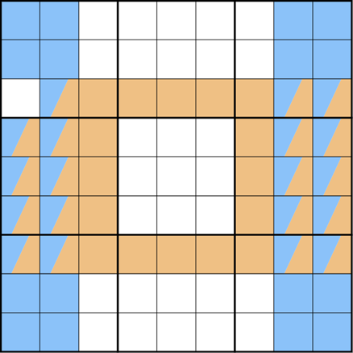
  <figcaption>Is blue still equal to orange?</figcaption>
</figure>

It might not seem obvious, since we don’t know what digit that was. But a moment of thought more might highlight the fact that regardless of what digit it was, we removed it from both blue and orange simultaneously. So if they were equal before, and we removed the same thing from both of them, then they must be equal after! (This may require a moment of reflection to convince yourself that this is true.)

Repeating this process of taking the same things out of both orange and blue (all of the cells that have both colours) reveals the Phistomefel ring above! Q.E.D.

## Set Equivalence Theory (SET)

You might have noticed in the above argument that the orange and blue sets of cells we chose seem a bit arbitrary. If you’ve come up with the question “what happens if we choose other sets?” then congratulations! You’ve just discovered the world of Set Equivalence Theory! Indeed, there are many other patterns that can arise by choosing other sets in Phistomefel’s theorem. Here is a similar pattern that can be argued for with almost identical logic. See if you can show that the orange set of cells must be the same as the blue set of cells in the picture below.

<figure style="display: flex; flex-direction: column; align-items: center; justify-content: center; text-align: center;">
  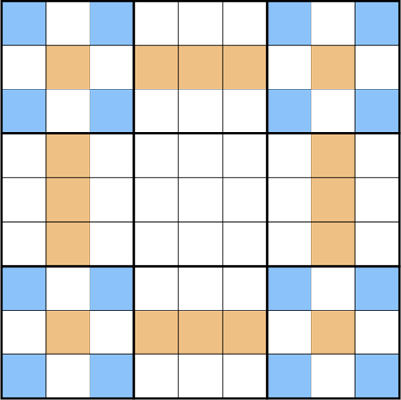
  <figcaption>Phistomefel’s “expanded ring”</figcaption>
</figure>

Better still, the ideas work for all Sudoku sizes! In what follows, I want to elucidate a solve path for one of my 4x4 sudoku’s “Thermo-regulated”. I encourage you to attempt to solve the puzzle yourself first. But if the theme of the article has got to you, you might consider looking for a SET pattern here to help guide your reasoning.

### Thermo-Regulated

  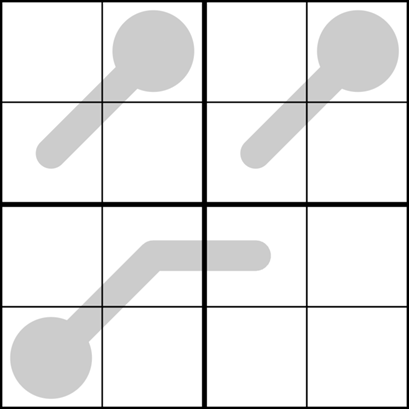
  

    <ul>
      <li> Normal 4x4 Sudoku rules apply.</li>
      <li>Digits along a thermometer increase from the bulb end.</li>
    </ul>
  

This can be finicky to solve if we approach it blindly. But attempting a SET argument can be revealing. Can you prove the equivalence of orange and blue in the picture below?

<figure style="display: flex; flex-direction: column; align-items: center; justify-content: center; text-align: center;">
  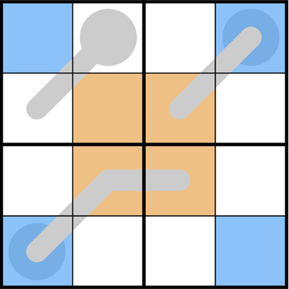
  <figcaption>Can you show that the orange cells must be equal to the blue cells?</figcaption>
</figure>

As soon as we have this equivalence, you might note that the orange cells “seem to contain lots of high digits” being towards the ends of thermometers, while the blue cells contain “low digits” in the bulbs. So if orange truly does equal blue, then where are these low “bulb” digits to be found in orange? This question is a guide to cracking open the puzzle for the first digit. Pause here and see if you can use this to guide you to a solution.

After doing the basic thermometer logic, we can get the following pencilmarks:

<figure style="display: flex; flex-direction: column; align-items: center; justify-content: center; text-align: center;">
  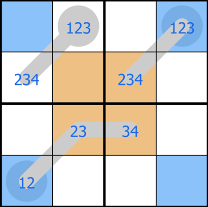
  <figcaption>Thermometers restrict the possibilities for the cells.</figcaption>
</figure>

At a glance, it seems like there could very well be a digit ‘1’ in blue, but the possible locations in orange are very restricted. If we can show that there is a 1 in blue, we should know exactly where to place it in orange. Can you force this case?

The arguing can proceed in two stages. Firstly, we can rule out the case that the pair of digits in row 4 column 1 and row 1 column 4 are the same. The reasoning for this is sudoku: there would be no place to put that digit in box 4! So we only need to rule out the case that the pair is 2 and 3. The only way this can happen is if row 4 column 1 is a 2 and row 1 column 4 is a 3. But a quick look at the thermometers in this case we see a contradiction, as both tips must be 4 breaking the rules of sudoku!

From this logic we can conclude that there must be a 1 in blue, at least somewhere, and hence there is a 1 in orange, but there is only one place to put it!

<figure style="display: flex; flex-direction: column; align-items: center; justify-content: center; text-align: center;">
  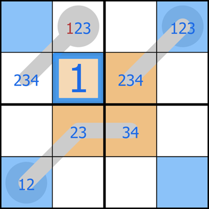
  <figcaption>Forcing a 1 into the blue cells actually allows us to place our first digit in orange due to SET! Isn’t that neat?!</figcaption>
</figure>

See if you can finish the puzzle from here!

I’ve mentioned some of my puzzles in a previous article, but see if using SET helps you solve these any easier. I’ve also included a difficult 6x6.

### Dueling Diagonals

  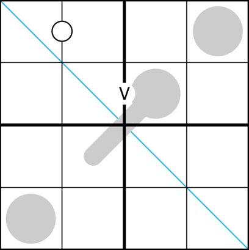
  

    <ul>
      <li> Normal 4x4 Sudoku rules apply.</li>
      <li>Digits on the blue diagonal do not repeat.</li>
      <li>Digits along a thermometer increase from the bulb end.</li>
      <li>Digits separated by a ‘V’ sum to five.</li>
      <li>Digits separated by a white dot are consecutive.</li>
      <li>Digits in a shaded circle (except for the thermometer bulb) must be odd.</li>
    </ul>
  

### Launch

  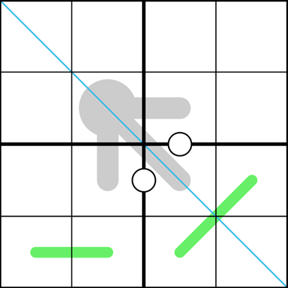
  

    <ul>
      <li> Normal 4x4 Sudoku rules apply.</li>
      <li>Digits along the blue diagonal do not repeat.</li>
      <li>Adjacent digits on a green line differ by at least two.</li>
      <li>Digits separated by a white dot are consecutive.</li>
      <li>Digits along a thermometer increase from the bulb end.</li>
    </ul>
  

### Taut

  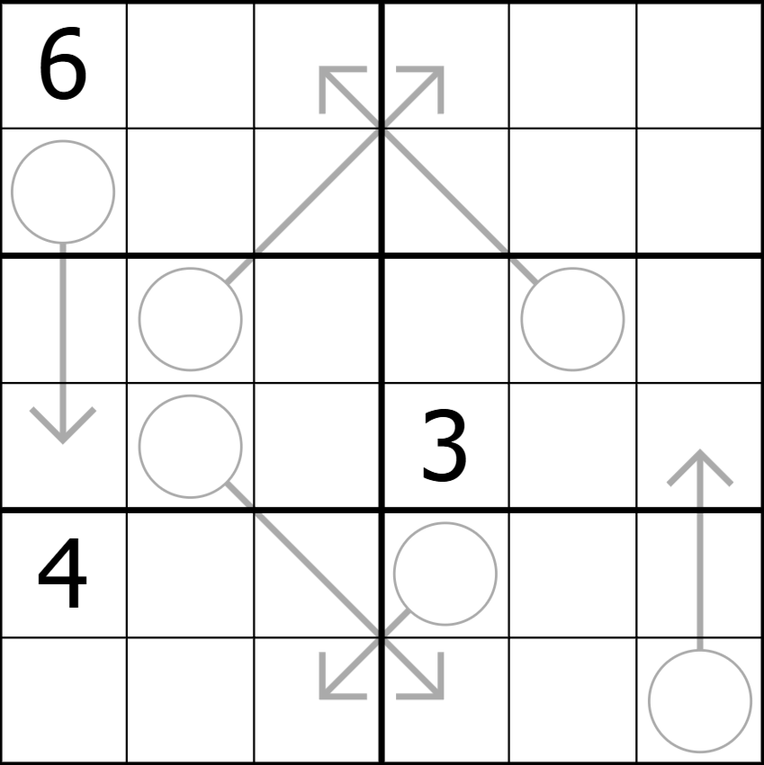
  

    <ul>
      <li>Normal 6x6 Sudoku rules apply.</li>
      <li>Digits along an arrow sum to the digit in that arrow’s circle.</li>
    </ul>
  

